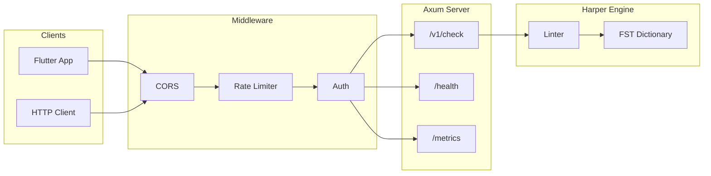

# Grammar API

Fast, open-source grammar and spelling API built with Rust and [Harper](https://github.com/Automattic/harper).

## Architecture



## Endpoints

| Method | Path | Description |
|--------|------|-------------|
| POST | `/v1/check` | Check text |
| GET | `/health` | Health check |
| GET | `/metrics` | Prometheus |

## Usage

```bash
cargo run --release

curl -X POST http://localhost:8080/v1/check \
  -H "Content-Type: application/json" \
  -d '{"text": "This is an test."}'
```

## Response

```json
{
  "matches": [{
    "message": "Did you mean 'a'?",
    "offset": 8,
    "length": 2,
    "replacements": ["a"],
    "rule": { "id": "AnA", "category": "grammar" },
    "context": { "text": "This is an test.", "offset": 8, "length": 2 }
  }],
  "metrics": { "processingTimeMs": 5 }
}
```

## Config

| Variable | Default | Description |
|----------|---------|-------------|
| `HOST` | `0.0.0.0` | Bind address |
| `PORT` | `8080` | Listen port |
| `API_KEY` | - | Auth key (optional) |
| `RATE_LIMIT_PER_SECOND` | `10` | Req/sec/IP |
| `RATE_LIMIT_BURST` | `30` | Burst size |
| `CORS_ORIGINS` | `*` | Allowed origins |

## Stack

| Component | Tech |
|-----------|------|
| Server | Axum |
| Grammar/Spelling | Harper |
| Metrics | Prometheus |
| Rate Limit | tower_governor |

## License

MIT
